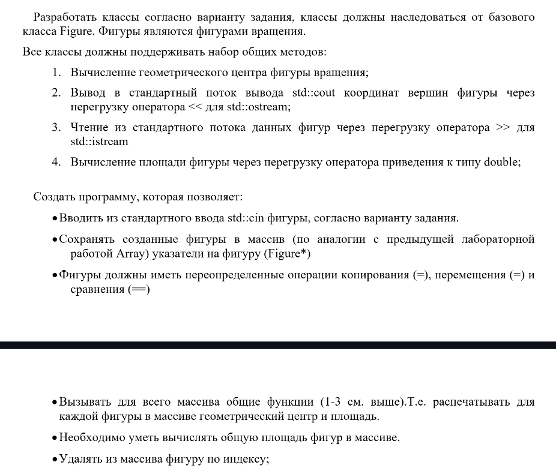

# Кудрявцев Егор Алексеевич М8О-211БВ-24
## Вариант 5



## Детали варианта
Ромб, 5-угольник, 6-угольник

# Инструкция по запуску

## 1. Создать папку для сборки и перейти в неё
```bash
mkdir build
cd build
```

## 2. Сгенерировать сборочные файлы при помощи CMake
```bash
cmake ..
```

## 3. Собрать проект
```bash
cmake --build .
```
ИЛИ
```bash
make
```